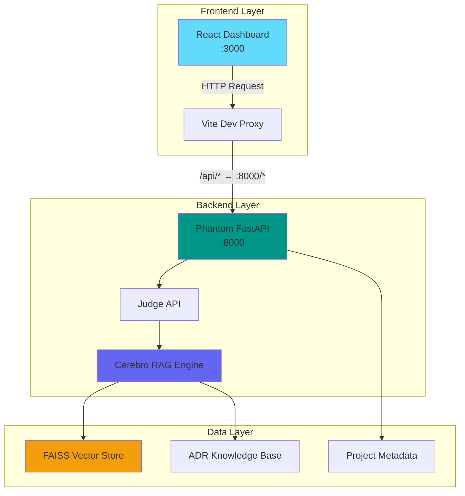

# 🎯 CEREBRO Dashboard - Technical Integration Guide

**Status**: Backend Integration Pending  
**Date**: 2026-01-26  
**Version**: 1.0.0

---

## 📋 Overview

This document details the integration between Cerebro Dashboard (React frontend) and Phantom Backend (FastAPI), including API contract specifications, data flow, and implementation roadmap.

---

## 🏗️ Architecture

### System Components



### Request Flow

1. **User Action** → React component triggers state change
2. **TanStack Query** → Calls API hook (`useApi.ts`)
3. **API Client** → HTTP request to `/api/endpoint`
4. **Vite Proxy** → Rewrites to `localhost:8000/endpoint`
5. **Phantom Backend** → Processes request, queries Cerebro RAG
6. **Response** → JSON data flows back through proxy
7. **React Update** → UI re-renders with new data

---

## 🔌 API Contract

### Required Endpoints

The dashboard expects the following REST API endpoints from the Phantom backend:

#### 1. System Status

```http
GET /api/status
```

**Response**:
```json
{
  "total_projects": 12,
  "active_projects": 8,
  "total_intelligence": 1847,
  "health_score": 87.3,
  "alerts_count": 3,
  "last_updated": "2026-01-26T00:20:00Z"
}
```

**TypeScript Interface**:
```typescript
interface SystemStatus {
  total_projects: number
  active_projects: number
  total_intelligence: number
  health_score: number  // 0-100
  alerts_count: number
  last_updated: string  // ISO 8601
}
```

---

#### 2. Projects List

```http
GET /api/projects?status=active&language=python&sort_by=health_score&order=asc
```

**Query Parameters**:
- `status`: `active` | `archived` | `maintenance` (optional)
- `language`: Language filter (optional)
- `sort_by`: `name` | `health_score` | `last_commit` | `size` (optional)
- `order`: `asc` | `desc` (optional)

**Response**:
```json
[
  {
    "name": "phantom",
    "path": "/home/kernelcore/arch/phantom",
    "status": "active",
    "health_score": 72.5,
    "languages": ["python", "nix"],
    "size_bytes": 15728640,
    "last_commit": "2026-01-25T18:30:00Z",
    "alerts": 2,
    "description": "Privacy-first data pipeline",
    "dependencies": {
      "total": 45,
      "outdated": 3,
      "vulnerable": 1
    }
  }
]
```

**TypeScript Interface**:
```typescript
interface Project {
  name: string
  path: string
  status: 'active' | 'archived' | 'maintenance'
  health_score: number  // 0-100
  languages: string[]
  size_bytes: number
  last_commit: string
  alerts: number
  description: string
  dependencies: {
    total: number
    outdated: number
    vulnerable: number
  }
}
```

---

#### 3. Project Details

```http
GET /api/projects/:name
```

**Response**:
```json
{
  "name": "phantom",
  "path": "/home/kernelcore/arch/phantom",
  "status": "active",
  "health_score": 72.5,
  "languages": ["python", "nix"],
  "size_bytes": 15728640,
  "last_commit": "2026-01-25T18:30:00Z",
  "alerts": 2,
  "description": "Privacy-first data pipeline",
  "git": {
    "branch": "main",
    "commits_count": 247,
    "contributors": 3
  },
  "dependencies": {
    "total": 45,
    "outdated": 3,
    "vulnerable": 1,
    "list": [
      {
        "name": "fastapi",
        "version": "0.109.0",
        "latest": "0.110.0",
        "outdated": true
      }
    ]
  },
  "security_issues": [
    {
      "severity": "medium",
      "type": "hardcoded_secret",
      "file": "config.py",
      "line": 23,
      "message": "Potential API key hardcoded"
    }
  ],
  "metrics": {
    "lines_of_code": 12450,
    "test_coverage": 82.5,
    "complexity_avg": 3.2
  }
}
```

---

#### 4. Intelligence Search

```http
POST /api/intelligence/query
Content-Type: application/json

{
  "query": "thermal management CPU temperature",
  "types": ["TECHINT", "SIGINT"],
  "projects": ["phantom", "ai-os-agent"],
  "limit": 10,
  "semantic": true
}
```

**Response**:
```json
{
  "results": [
    {
      "id": "ADR-0001",
      "type": "TECHINT",
      "title": "Sistema de Monitoramento Térmico",
      "content": "O sistema implementa monitoramento contínuo de temperatura...",
      "score": 0.89,
      "project": "phantom",
      "timestamp": "2026-01-15T10:00:00Z",
      "metadata": {
        "status": "accepted",
        "tags": ["thermal", "monitoring", "temperature"]
      }
    }
  ],
  "total": 5,
  "query_time_ms": 45
}
```

**TypeScript Interface**:
```typescript
interface IntelligenceQueryRequest {
  query: string
  types?: IntelligenceType[]
  projects?: string[]
  limit?: number
  semantic?: boolean
}

type IntelligenceType = 'SIGINT' | 'HUMINT' | 'OSINT' | 'TECHINT'

interface IntelligenceItem {
  id: string
  type: IntelligenceType
  title: string
  content: string
  score: number  // 0-1 similarity score
  project?: string
  timestamp: string
  metadata: {
    status: string
    tags: string[]
  }
}

interface IntelligenceQueryResponse {
  results: IntelligenceItem[]
  total: number
  query_time_ms: number
}
```

---

#### 5. Intelligence Statistics

```http
GET /api/intelligence/stats
```

**Response**:
```json
{
  "total_items": 1847,
  "by_type": {
    "SIGINT": 412,
    "HUMINT": 98,
    "OSINT": 876,
    "TECHINT": 461
  },
  "by_project": {
    "phantom": 234,
    "cerebro": 189,
    "neutron": 156
  },
  "recent_additions": 23,
  "last_indexed": "2026-01-26T00:15:00Z"
}
```

---

#### 6. Daily Briefing

```http
GET /api/briefing/daily
```

**Response**:
```json
{
  "date": "2026-01-26",
  "summary": "System health remains stable at 87%. 3 new alerts detected in phantom project requiring attention. Thermal monitoring improvements implemented successfully.",
  "key_developments": [
    {
      "type": "feature",
      "title": "Dashboard Integration Complete",
      "description": "React dashboard deployed with real-time metrics",
      "project": "cerebro",
      "threat_level": "info"
    },
    {
      "type": "alert",
      "title": "High Memory Usage Detected",
      "description": "Phantom service consuming 85% memory",
      "project": "phantom",
      "threat_level": "medium"
    }
  ],
  "metrics_summary": {
    "projects_scanned": 12,
    "new_intelligence": 23,
    "alerts_raised": 3,
    "health_change": -2.1
  },
  "recommendations": [
    "Investigate memory leak in phantom service",
    "Update outdated dependencies in neutron",
    "Review thermal alerts from last 24h"
  ]
}
```

**TypeScript Interface**:
```typescript
interface Briefing {
  date: string
  summary: string
  key_developments: Development[]
  metrics_summary: {
    projects_scanned: number
    new_intelligence: number
    alerts_raised: number
    health_change: number
  }
  recommendations: string[]
}

interface Development {
  type: 'feature' | 'alert' | 'security' | 'update'
  title: string
  description: string
  project: string
  threat_level: 'critical' | 'high' | 'medium' | 'low' | 'info'
}
```

---

#### 7. Executive Briefing

```http
GET /api/briefing/executive
```

**Response**: Similar to Daily Briefing but with higher-level strategic insights.

---

#### 8. Alerts

```http
GET /api/alerts?severity=critical,high&limit=20
```

**Query Parameters**:
- `severity`: Filter by severity (comma-separated)
- `limit`: Max results (default: 50)

**Response**:
```json
[
  {
    "id": "alert-12345",
    "timestamp": "2026-01-26T00:15:00Z",
    "severity": "critical",
    "category": "thermal",
    "message": "CPU temperature exceeded 82°C",
    "project": "ai-os-agent",
    "affected_components": ["cpu_monitor", "thermal_service"],
    "recommended_actions": [
      "Reduce workload immediately",
      "Check cooling system",
      "Review thermal management ADRs"
    ],
    "related_adrs": ["ADR-0001", "ADR-0003"]
  }
]
```

**TypeScript Interface**:
```typescript
interface Alert {
  id: string
  timestamp: string
  severity: 'critical' | 'high' | 'medium' | 'low' | 'info'
  category: string
  message: string
  project?: string
  affected_components: string[]
  recommended_actions: string[]
  related_adrs: string[]
}
```

---

#### 9. Dependency Graph

```http
GET /api/graph/dependencies?project=phantom
```

**Response**:
```json
{
  "nodes": [
    {
      "id": "phantom",
      "type": "project",
      "label": "Phantom"
    },
    {
      "id": "cerebro",
      "type": "dependency",
      "label": "Cerebro RAG"
    }
  ],
  "edges": [
    {
      "source": "phantom",
      "target": "cerebro",
      "type": "depends_on"
    }
  ]
}
```

---

#### 10. Actions

##### Trigger Scan
```http
POST /api/actions/scan
Content-Type: application/json

{
  "path": "/home/kernelcore/arch/phantom"
}
```

**Response**:
```json
{
  "job_id": "scan-20260126-001",
  "status": "started",
  "estimated_time_seconds": 45
}
```

##### Summarize Project
```http
POST /api/actions/summarize/:projectName
```

**Response**:
```json
{
  "summary": "Phantom is a privacy-first data pipeline with 72.5% health score. Key issues: 2 medium-severity security findings, 3 outdated dependencies..."
}
```

---

## 🛠️ Implementation Roadmap

### Phase 1: Minimal Backend (1-2 hours)

**Goal**: Dashboard displays data (even if mocked)

**Tasks**:
1. Create FastAPI app in `phantom/src/phantom/api/app.py`
2. Implement `/api/status` with hardcoded values
3. Implement `/api/projects` returning static list
4. Add CORS middleware for `localhost:3000`
5. Test with `curl` and browser

**Acceptance Criteria**:
- ✅ Dashboard loads without errors
- ✅ Status cards show data
- ✅ Projects list populates

---

### Phase 2: Cerebro Integration (2-3 hours)

**Goal**: Real semantic search working

**Tasks**:
1. Connect `/api/intelligence/query` to `CerebroRAG` engine
2. Index existing ADRs from adr-ledger
3. Implement search with FAISS vector store
4. Add caching for frequently searched queries
5. Test semantic search in dashboard

**Acceptance Criteria**:
- ✅ Search returns relevant ADRs
- ✅ Scores are meaningful (0.5-1.0 range)
- ✅ Query time < 100ms

---

### Phase 3: Project Scanning (3-4 hours)

**Goal**: Auto-discover projects in ~/arch

**Tasks**:
1. Implement project scanner (walk directories)
2. Extract metadata (git info, languages, size)
3. Calculate health scores (test coverage, security, freshness)
4. Persist to lightweight DB (SQLite or JSON)
5. Add `/api/actions/scan` endpoint

**Acceptance Criteria**:
- ✅ All ~/arch projects visible
- ✅ Health scores calculated correctly
- ✅ Metadata accurate

---

### Phase 4: Briefings & Alerts (2-3 hours)

**Goal**: AI-generated insights

**Tasks**:
1. Implement briefing generator (template or LLM)
2. Aggregate alerts from system logs
3. Link alerts to relevant ADRs via Cerebro
4. Add `/api/briefing/daily` endpoint
5. Add `/api/alerts` endpoint

**Acceptance Criteria**:
- ✅ Briefings are coherent and useful
- ✅ Alerts are actionable
- ✅ ADRs linked correctly

---

## 🧪 Testing Strategy

### Mock Backend (Quick Start)

For frontend development without backend:

```python
# phantom/src/phantom/api/mock_server.py
from fastapi import FastAPI
from fastapi.middleware.cors import CORSMiddleware

app = FastAPI()

app.add_middleware(
    CORSMiddleware,
    allow_origins=["http://localhost:3000"],
    allow_methods=["*"],
    allow_headers=["*"],
)

@app.get("/api/status")
def get_status():
    return {
        "total_projects": 12,
        "active_projects": 8,
        "total_intelligence": 1847,
        "health_score": 87.3,
        "alerts_count": 3,
        "last_updated": "2026-01-26T00:20:00Z"
    }

@app.get("/api/projects")
def get_projects():
    return [
        {
            "name": "phantom",
            "status": "active",
            "health_score": 72.5,
            "languages": ["python"],
            "size_bytes": 15728640,
            "last_commit": "2026-01-25T18:30:00Z",
            "alerts": 2
        }
    ]

if __name__ == "__main__":
    import uvicorn
    uvicorn.run(app, host="0.0.0.0", port=8000)
```

Run with:
```bash
cd /home/kernelcore/arch/phantom/src
python3 phantom/api/mock_server.py
```

---

### Integration Tests

Create `integration-tests/test_dashboard_api.sh`:

```bash
#!/usr/bin/env bash
set -e

API_BASE="http://localhost:8000/api"

echo "🧪 Testing Cerebro Dashboard API Integration"
echo "============================================"

# Test 1: Status endpoint
echo "✅ Testing /api/status..."
curl -s "$API_BASE/status" | jq .health_score > /dev/null

# Test 2: Projects endpoint
echo "✅ Testing /api/projects..."
curl -s "$API_BASE/projects" | jq 'length' > /dev/null

# Test 3: Intelligence search
echo "✅ Testing /api/intelligence/query..."
curl -s -X POST "$API_BASE/intelligence/query" \
  -H "Content-Type: application/json" \
  -d '{"query": "thermal management", "limit": 5}' \
  | jq '.results | length' > /dev/null

echo "✅ All tests passed!"
```

---

## 🚀 Deployment Checklist

### Development
- [ ] Backend mock server running
- [ ] Frontend dev server running
- [ ] CORS configured
- [ ] API endpoints responding

### Staging
- [ ] Real Cerebro RAG integrated
- [ ] Project scanner working
- [ ] Briefings generating
- [ ] Alerts system functional

### Production
- [ ] HTTPS enabled
- [ ] Authentication added
- [ ] Rate limiting configured
- [ ] Monitoring setup (Prometheus)
- [ ] Error tracking (Sentry)
- [ ] Database migrations tested
- [ ] Backup strategy implemented

---

## 📊 Performance Targets

| Metric | Target | Notes |
|--------|--------|-------|
| **Page Load** | < 2s | Initial dashboard render |
| **API Response** | < 200ms | Average endpoint latency |
| **Search Query** | < 500ms | Semantic search with FAISS |
| **Project Scan** | < 30s | Full ~/arch directory scan |
| **Briefing Generation** | < 5s | Daily/executive summary |

---

## 🔒 Security Considerations

### CORS
- Allow `localhost:3000` in development
- Restrict to `cerebro.example.com` in production

### Authentication
- Add JWT token validation to all endpoints
- Implement role-based access control (RBAC)
- Audit log for sensitive actions

### Data Validation
- Sanitize all user inputs
- Validate query parameters
- Rate limit search queries

---

## 🤝 Next Steps

1. **Choose Implementation Path**:
   - **Quick**: Start with mock backend → validate UX → build real backend
   - **Complete**: Build real backend immediately with Cerebro integration

2. **Assign Priorities**:
   - P0: Status, Projects (basic dashboard functionality)
   - P1: Intelligence search (core value prop)
   - P2: Briefings, Alerts (enhanced insights)
   - P3: Actions, Graph (advanced features)

3. **Set Timeline**:
   - Sprint 1 (Week 1): Mock backend + frontend polish
   - Sprint 2 (Week 2): Cerebro integration + project scanning
   - Sprint 3 (Week 3): Briefings + alerts + testing
   - Sprint 4 (Week 4): Production hardening + deployment

---

**Status**: ✅ **Ready for Backend Development**

**Contact**: Dashboard frontend complete, awaiting Phantom API implementation

**Last Updated**: 2026-01-26
