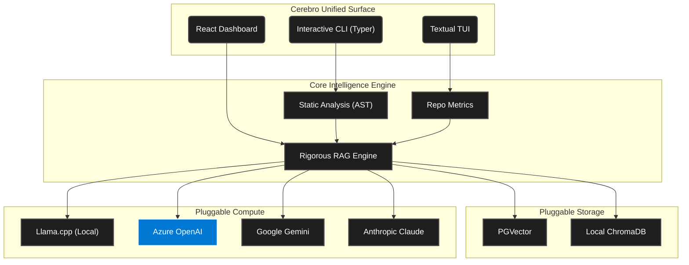

<div align="center">

# 🧠 CEREBRO

**Enterprise Knowledge Extraction & Distributed RAG Platform**

[](https://www.python.org/)
[](https://nixos.org/)
[](https://reactjs.org/)
[](https://kubernetes.io/)

</div>

---

**Cerebro** is a highly modular, standalone, hermetic knowledge and repository intelligence platform. It seamlessly bridges deep static analysis, state-of-the-art Retrieval Augmented Generation (RAG), and extensive Cloud integration, accessible through a powerful **triple-interface design**.

Built strictly around **Nix-first** reproducibility, the core runtime guarantees that what runs on your local machine scales flawlessly to your production Kubernetes clusters and Enterprise cloud environments.

## ✨ Core Capabilities

*   **Rigorous RAG Engine:** At its core, the `RigorousRAGEngine` handles complex context retrieval from multiple sources, generating highly precise, grounded answers.
*   **Triple-Interface Architecture:**
    *   💻 **CLI (Command Line):** Built with Typer, perfect for automation, CI/CD, and fast interactions (`knowledge`, `ops`, `rag`, `metrics`).
    *   🖥️ **TUI (Textual UI):** A rich, interactive terminal interface for immediate deep-dives into your codebase.
    *   🌐 **GUI / Dashboard:** A modern React/Vite dashboard built with TypeScript and TailwindCSS for visual system management.
*   **Intelligence & Analysis:** Built-in capability to analyze codebases (`analyzer`), extract knowledge (`briefing`), and compute repository metrics (zero-token analysis).
*   **Cloud & DevOps Native:** Deploy effortlessly with robust Kubernetes manifests, Docker containers, and CI/CD pipelines targeting Azure and GCP.

## 🔌 Pluggable Providers & Integrations

Cerebro utilizes a strict Factory pattern, ensuring seamless drop-in support for your preferred AI models and Vector Stores.

**Supported LLM Backends:**
*   Google Gemini
*   Anthropic Claude
*   OpenAI (and OpenAI-compatible endpoints)
*   Groq
*   Llama.cpp (for air-gapped/local execution)

**Supported Vector Stores:**
*   PGVector (PostgreSQL)
*   ChromaDB
*   Elasticsearch (Hybrid RRF)

## ⚡ 1-Minute Quickstart

> [!TIP]
> The fastest way to get started is via the Nix hermetic shell. No virtual environments, no hidden global dependencies.

```bash
# 1. Enter the hermetic development environment
nix develop

# 2. Run the interactive setup to configure your Cloud and LLM settings
cerebro setup

# 3. Use the CLI to ingest knowledge
cerebro knowledge analyze . "General codebase review"
cerebro rag ingest ./data/analyzed/all_artifacts.jsonl

# 4. Query your intelligence engine
cerebro rag query "Explain the architecture of the Core Services"
```

## 🏗️ Architecture Layout



## 🚀 Deployment & Operations

Cerebro is enterprise-ready and built to scale:
*   **Kubernetes Orchestration:** Check the `/kubernetes` directory for production-grade `Deployment`, `Service`, and `Ingress` YAML definitions (optimized for AKS).
*   **CI/CD Pipelines:** Out-of-the-box workflows for GitHub Actions, GitLab CI, and Azure Pipelines.
*   **Operational Arsenal:** The `/scripts` directory includes a suite of utility tools for load testing, ETL docs parsing, grounded search evaluations, and billing monitors.

## 🛠️ Developer Guidelines

1. **Always use Nix.** Never `pip install` globally. Manage dependencies explicitly via `flake.nix` and `poetry2nix`.
2. **Interface First:** Any new AI provider or Vector Store must implement the abstract interfaces defined in the core (`src/cerebro/providers/`).
3. **Command Discovery:** Use `cerebro --help` or type `chelp` inside the Nix shell to explore the extensive command capabilities.

---
<div align="center">
<i>Proprietary internal architecture. Built tightly, hermetically mapped, and highly scalable.</i>
</div>