# 🧠 CEREBRO Intelligence Dashboard

**Modern React dashboard for Cerebro RAG Knowledge System**

[](https://react.dev/)
[](https://www.typescriptlang.org/)
[](https://vitejs.dev/)
[](https://tailwindcss.com/)

---

## 🎯 Overview

Real-time intelligence dashboard for the Cerebro RAG (Retrieval-Augmented Generation) system. Provides visual interface for:

- **System Monitoring**: Health scores, metrics, and status tracking
- **Project Intelligence**: Code analysis, security insights, and dependency graphs
- **Semantic Search**: Natural language queries across ADR knowledge base
- **Briefings**: Daily and executive summaries with AI-powered insights
- **Alerts**: Critical notifications and threat intelligence

---

## 🏗️ Architecture

```mermaid
graph LR
    A[React Dashboard] -->|HTTP/REST| B[Vite Dev Proxy]
    B -->|:3000/api → :8000| C[Phantom Backend]
    C --> D[Cerebro RAG Engine]
    D --> E[FAISS Vector Store]
    D --> F[ADR Knowledge Base]
    
    style A fill:#61DAFB
    style C fill:#009688
    style D fill:#6366f1
    style E fill:#f59e0b
```



### Tech Stack

| Layer | Technology | Purpose |
|-------|-----------|---------|
| **Framework** | React 18 | UI rendering & state management |
| **Build Tool** | Vite 5 | Fast HMR & optimized bundling |
| **Language** | TypeScript 5.5 | Type safety & developer experience |
| **Styling** | TailwindCSS 3.4 | Utility-first CSS framework |
| **Routing** | React Router 6 | Client-side navigation |
| **Data Fetching** | TanStack Query 5 | Server state management |
| **Animations** | Framer Motion 11 | Smooth transitions & interactions |
| **Icons** | Lucide React | Consistent icon system |
| **Components** | Radix UI | Accessible primitives |

---

## 🚀 Quick Start

### Prerequisites

- **Node.js**: 18+ (LTS recommended)
- **npm**: 9+ or equivalent package manager
- **Backend**: Phantom API running on `localhost:8000`

### Installation

```bash
# From cerebro/dashboard directory
npm install
```

### Development

```bash
# Start dev server (http://localhost:3000)
npm run dev

# Type check
npm run type-check

# Build for production
npm run build

# Preview production build
npm run preview
```

### Environment Variables

Create `.env.local` (optional):

```env
# Backend API base URL (default: proxied via Vite)
VITE_API_BASE=http://localhost:8000/api

# Enable debug mode
VITE_DEBUG=true

# Custom port
VITE_PORT=3000
```

---

## 📊 Features

### 1. Dashboard Overview

**Route**: `/`

- **System Status**: Real-time health indicator (Online/Offline/Degraded)
- **Metrics Cards**:
  - Total Projects & Active count
  - Intelligence Items (indexed artifacts)
  - Ecosystem Health Score (0-100%)
  - Active Alerts count with severity
- **Projects Needing Attention**: Top 5 projects sorted by health score
- **Recent Alerts**: Critical notifications with project context
- **Daily Briefing**: AI-generated summary of key developments
- **Quick Actions**: Shortcuts to search, briefing, and projects

**Components**:
- `src/pages/Dashboard.tsx`
- `src/components/dashboard/Header.tsx`
- `src/components/ui/card.tsx`, `badge.tsx`, `progress.tsx`

---

### 2. Projects Browser

**Route**: `/projects`, `/projects/:projectName`

**Features**:
- **List View**: All projects with filtering and sorting
  - Filter by: Status (active/archived), Language, Health score
  - Sort by: Name, Health, Last commit, Size
- **Project Details**: Deep dive into selected project
  - Repository metadata (size, languages, dependencies)
  - Health metrics breakdown
  - Recent commits and activity
  - Security issues and recommendations
  - Dependency graph visualization

**Components**:
- `src/pages/Projects.tsx`

---

### 3. Intelligence Search

**Route**: `/intelligence`

**Capabilities**:
- **Semantic Search**: Natural language queries across ADRs
- **Type Filtering**: SIGINT, HUMINT, OSINT, TECHINT classification
- **Project Scoping**: Search within specific projects
- **Relevance Scoring**: Similarity scores for each result
- **Context Preview**: Highlighted snippets from matching documents

**Search Examples**:
```
"thermal management and CPU temperature"
"authentication middleware patterns"
"database migration strategies"
"security vulnerabilities in API layer"
```

**Components**:
- `src/pages/Intelligence.tsx`
- `src/hooks/useApi.ts` (useIntelligenceQuery)

---

### 4. Briefings

**Route**: `/briefing`

**Types**:
- **Daily Briefing**: 24-hour summary of system activity
  - Key developments and changes
  - New alerts and issues
  - Project updates
  - Recommended actions
  
- **Executive Briefing**: High-level strategic overview
  - Ecosystem health trends
  - Critical decisions required
  - Resource recommendations
  - Risk assessment

**Components**:
- `src/pages/Briefing.tsx`
- `src/hooks/useApi.ts` (useDailyBriefing, useExecutiveBriefing)

---

### 5. Settings

**Route**: `/settings`

**Configuration**:
- **Auto-Refresh**: Toggle and interval (5s - 5m)
- **Theme**: Dark/Light mode toggle
- **Notifications**: Alert preferences
- **Display**: Density, animations, language

**Components**:
- `src/pages/Settings.tsx`
- `src/stores/dashboard.ts` (Zustand state)

---

## 🎨 Design System

### Color Palette

**Cerebro Brand Colors** (defined in `tailwind.config.js`):

```typescript
cerebro: {
  primary: '#6366f1',    // Indigo - Primary actions
  secondary: '#8b5cf6',  // Violet - Secondary actions
  accent: '#06b6d4',     // Cyan - Highlights
  success: '#22c55e',    // Green - Positive states
  warning: '#f59e0b',    // Amber - Warnings
  danger: '#ef4444',     // Red - Errors/Critical
  info: '#3b82f6',       // Blue - Information
}
```

**Intelligence Types**:
```typescript
intel: {
  sigint: '#f59e0b',   // Signals Intelligence - Amber
  humint: '#22c55e',   // Human Intelligence - Green
  osint: '#3b82f6',    // Open Source - Blue
  techint: '#8b5cf6',  // Technical - Violet
}
```

**Threat Levels**:
```typescript
threat: {
  critical: '#ef4444',
  high: '#f97316',
  medium: '#f59e0b',
  low: '#22c55e',
  info: '#3b82f6',
}
```

### Typography

- **Font Family**: System fonts (optimized for performance)
- **Headings**: `font-bold tracking-tight`
- **Body**: `font-sans antialiased`
- **Code**: `font-mono text-sm`

### Animations

**Framer Motion Variants** (`src/index.css`):
- `pulse-glow`: Status indicators (2s infinite)
- `slide-in`: Panel entrance (0.3s ease-out)
- `fade-in`: Content loading (0.2s ease-in)

---

## 🔌 API Integration

### Backend Endpoints

**Base URL**: `http://localhost:8000/api` (proxied from `:3000/api`)

| Endpoint | Method | Purpose |
|----------|--------|---------|
| `/status` | GET | System health & metrics |
| `/projects` | GET | List all projects |
| `/projects/:name` | GET | Project details |
| `/intelligence/query` | POST | Semantic search |
| `/intelligence/stats` | GET | Intelligence statistics |
| `/briefing/daily` | GET | Daily briefing |
| `/briefing/executive` | GET | Executive summary |
| `/alerts` | GET | Active alerts |
| `/graph/dependencies` | GET | Dependency graph |
| `/actions/scan` | POST | Trigger repository scan |

### Type Definitions

See `src/types/index.ts` for complete TypeScript interfaces:

```typescript
interface SystemStatus {
  total_projects: number
  active_projects: number
  total_intelligence: number
  health_score: number
  alerts_count: number
  last_updated: string
}

interface Project {
  name: string
  status: 'active' | 'archived' | 'maintenance'
  health_score: number
  languages: string[]
  size_bytes: number
  last_commit: string
  alerts: number
}

interface IntelligenceItem {
  id: string
  type: 'SIGINT' | 'HUMINT' | 'OSINT' | 'TECHINT'
  title: string
  content: string
  score: number
  project?: string
  timestamp: string
}
```

---

## 📁 Project Structure

```
dashboard/
├── src/
│   ├── components/        # Reusable UI components
│   │   ├── dashboard/     # Dashboard-specific components
│   │   │   ├── Header.tsx       # Top navigation bar
│   │   │   ├── Sidebar.tsx      # Left navigation menu
│   │   │   └── Layout.tsx       # Main layout wrapper
│   │   └── ui/            # Shadcn-style primitives
│   │       ├── button.tsx
│   │       ├── card.tsx
│   │       ├── badge.tsx
│   │       ├── input.tsx
│   │       ├── progress.tsx
│   │       └── toaster.tsx
│   ├── pages/             # Route components
│   │   ├── Dashboard.tsx        # Main dashboard (/)
│   │   ├── Projects.tsx         # Projects view (/projects)
│   │   ├── Intelligence.tsx     # Search interface (/intelligence)
│   │   ├── Briefing.tsx         # Briefings (/briefing)
│   │   └── Settings.tsx         # Configuration (/settings)
│   ├── hooks/             # Custom React hooks
│   │   └── useApi.ts            # TanStack Query hooks
│   ├── stores/            # State management
│   │   └── dashboard.ts         # Zustand store
│   ├── lib/               # Utilities & services
│   │   ├── api.ts               # API client
│   │   └── utils.ts             # Helper functions
│   ├── types/             # TypeScript definitions
│   │   └── index.ts             # Shared types
│   ├── App.tsx            # Root component & routing
│   ├── main.tsx           # React entry point
│   └── index.css          # Global styles & Tailwind
├── public/                # Static assets
├── index.html             # HTML entry point
├── vite.config.ts         # Vite configuration
├── tailwind.config.js     # Tailwind configuration
├── tsconfig.json          # TypeScript configuration
├── package.json           # Dependencies & scripts
└── README.md              # This file
```

---

## 🧪 Development Workflow

### Code Style

- **TypeScript**: Strict mode enabled
- **ESLint**: React + TypeScript rules
- **Prettier**: Auto-formatting (on save)

### Component Patterns

**Example**: Creating a new page

```typescript
// src/pages/MyPage.tsx
import { motion } from 'framer-motion'
import { Card, CardContent, CardHeader, CardTitle } from '@/components/ui/card'
import { useMyData } from '@/hooks/useApi'

export function MyPage() {
  const { data, isLoading } = useMyData()

  return (
    <div className="space-y-6">
      <h1 className="text-3xl font-bold tracking-tight">My Page</h1>
      
      <Card>
        <CardHeader>
          <CardTitle>Content</CardTitle>
        </CardHeader>
        <CardContent>
          {isLoading ? 'Loading...' : data}
        </CardContent>
      </Card>
    </div>
  )
}
```

### Adding API Endpoints

1. **Add type** in `src/types/index.ts`
2. **Add method** in `src/lib/api.ts`
3. **Add hook** in `src/hooks/useApi.ts`
4. **Use in component**

```typescript
// 1. Type
export interface MyData {
  field: string
}

// 2. API method
async getMyData(): Promise<MyData> {
  return this.fetch<MyData>('/my-endpoint')
}

// 3. Hook
export function useMyData() {
  return useQuery({
    queryKey: ['myData'],
    queryFn: api.getMyData,
  })
}

// 4. Component
const { data } = useMyData()
```

---

## 🚢 Production Deployment

### Build

```bash
npm run build
# Output: dist/
```

### Docker

```dockerfile
FROM node:20-alpine AS builder
WORKDIR /app
COPY package*.json ./
RUN npm ci
COPY . .
RUN npm run build

FROM nginx:alpine
COPY --from=builder /app/dist /usr/share/nginx/html
COPY nginx.conf /etc/nginx/conf.d/default.conf
EXPOSE 80
CMD ["nginx", "-g", "daemon off;"]
```

### Environment Variables (Production)

```env
VITE_API_BASE=https://api.cerebro.example.com
VITE_WS_URL=wss://api.cerebro.example.com/ws
```

---

## 🐛 Troubleshooting

### Dashboard won't load

1. **Check backend**: `curl http://localhost:8000/health`
2. **Verify proxy**: Check `vite.config.ts` proxy settings
3. **Browser console**: Look for CORS or network errors

### API errors (500/404)

1. **Backend running**: Ensure Phantom API is started
2. **Endpoints exist**: Verify URL matches backend routes
3. **Check logs**: Backend console for Python traceback

### Slow performance

1. **Disable auto-refresh**: In Settings page
2. **Reduce query limit**: Lower `top_k` in Intelligence search
3. **Clear cache**: Hard refresh (Ctrl+Shift+R)

---

## 🤝 Contributing

### Adding a New Feature

1. **Plan**: Update this README with feature spec
2. **Implement**: Follow component patterns above
3. **Test**: Verify with backend integration
4. **Document**: Add usage examples

### Code Review Checklist

- [ ] TypeScript types defined
- [ ] Error handling implemented
- [ ] Loading states handled
- [ ] Responsive design tested
- [ ] Accessibility checked (keyboard nav, ARIA)
- [ ] Performance optimized (memoization, lazy loading)

---

## 📜 License

MIT License - Part of the Cerebro project

---

## 🙏 Acknowledgments

Built with:
- [React](https://react.dev/) - UI framework
- [Vite](https://vitejs.dev/) - Build tool
- [TailwindCSS](https://tailwindcss.com/) - Styling
- [TanStack Query](https://tanstack.com/query) - Data fetching
- [Framer Motion](https://www.framer.com/motion/) - Animations
- [Radix UI](https://www.radix-ui.com/) - Accessible components

Inspired by:
- [shadcn/ui](https://ui.shadcn.com/) - Component design patterns
- [Vercel Dashboard](https://vercel.com/) - UX principles
- [Linear](https://linear.app/) - Clean aesthetics

---

**Status**: ✅ **Production Ready** (pending backend integration)

**Last Updated**: 2026-01-26  
**Version**: 1.0.0
